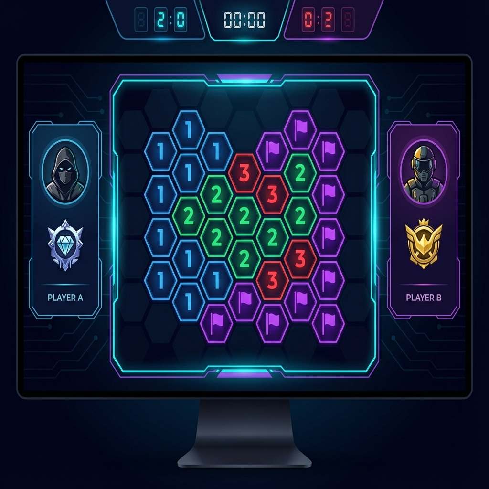

# Minesweeper Duel 💣

A competitive 1v1 multiplayer Minesweeper website. Challenge friends, race to clear your board, and climb the ranks!



## 🎮 Features

- **1v1 Competitive Gameplay** - Race against a real opponent on the same board
- **Player-Hosted Matches** - No central servers, no costs, free forever
- **Ranked System** - Track your progress from Bronze to Champion
- **Modern, Clean UI** - Premium dark theme with smooth animations
- **Fully Responsive** - Works on desktop, tablet, and mobile
- **Static Site** - Deploys anywhere, no backend required

## 🚀 Quick Start

### Option 1: Just Open It
Since this is a static site, you can simply open `index.html` in your browser!

```bash
# On Windows
start index.html

# On macOS
open index.html

# On Linux
xdg-open index.html
```

### Option 2: Use a Local Server (Recommended)
For the best development experience, use a local server:

```bash
# Using Python
python -m http.server 8000

# Using Node.js (if you have npx)
npx serve .

# Using PHP
php -S localhost:8000
```

Then open http://localhost:8000 in your browser.

## 📁 Project Structure

```
minesweeper-duel/
├── index.html              # Main HTML file (SPA with all views)
├── 404.html               # GitHub Pages SPA redirect support
├── README.md              # This file
├── assets/
│   ├── css/
│   │   └── styles.css     # Complete design system & styles
│   ├── js/
│   │   └── app.js         # SPA routing & interactions
│   └── images/            # Static images (optional)
└── .nojekyll              # Tells GitHub Pages to skip Jekyll processing
```

## 🎨 Design System

The CSS includes a comprehensive design system with:

### Color Tokens
```css
--color-accent-primary: #00d4ff;    /* Cyan accent */
--color-accent-secondary: #7b5cff;  /* Purple accent */
--color-bg-primary: #0a0a0f;        /* Dark background */
--color-bg-card: #16161f;           /* Card background */
```

### Typography
- **Display Font**: Outfit (headings)
- **Body Font**: Inter (content)
- **Mono Font**: JetBrains Mono (game codes)

### Components
- Buttons (primary, secondary, ghost)
- Cards (with hover effects)
- Form inputs
- Badges
- Accordions
- Toast notifications
- Stats grids

## 🌐 Deploying to GitHub Pages

### Method 1: Deploy from Repository Root

1. Push your code to GitHub:
   ```bash
   git init
   git add .
   git commit -m "Initial commit"
   git branch -M main
   git remote add origin https://github.com/YOUR_USERNAME/minesweeper-duel.git
   git push -u origin main
   ```

2. Go to your repository on GitHub
3. Navigate to **Settings** → **Pages**
4. Under "Source", select **Deploy from a branch**
5. Select the `main` branch and `/ (root)` folder
6. Click **Save**

Your site will be live at: `https://YOUR_USERNAME.github.io/minesweeper-duel/`

### Method 2: Using GitHub Actions (Optional)

Create `.github/workflows/deploy.yml`:

```yaml
name: Deploy to GitHub Pages

on:
  push:
    branches: [main]

permissions:
  contents: read
  pages: write
  id-token: write

jobs:
  deploy:
    runs-on: ubuntu-latest
    steps:
      - uses: actions/checkout@v4
      - uses: actions/configure-pages@v4
      - uses: actions/upload-pages-artifact@v3
        with:
          path: '.'
      - uses: actions/deploy-pages@v4
```

## 🔧 Customization

### Changing the Accent Color
Edit the CSS variables in `assets/css/styles.css`:

```css
:root {
  --color-accent-primary: #your-color;
  --color-accent-gradient: linear-gradient(135deg, #color1, #color2);
}
```

### Adding Real Networking
The current implementation uses mock/placeholder functions. To add real peer-to-peer networking:

1. Integrate a WebRTC library (e.g., PeerJS, simple-peer)
2. Set up a signaling server or use a free service
3. Replace the mock handlers in `app.js`:
   - `handleCreateGame()` → Create a peer and generate offer
   - `handleJoinGame()` → Connect to host using game code

### Adding More FAQ Items
Edit the `MockData.faq` array in `app.js`:

```javascript
{
  question: 'Your question here?',
  answer: 'Your detailed answer here.'
}
```

## 📱 Browser Support

- Chrome 80+
- Firefox 75+
- Safari 13+
- Edge 80+

## 🛠️ Technology Stack

- **HTML5** - Semantic markup
- **CSS3** - Custom properties, Grid, Flexbox
- **Vanilla JavaScript** - No dependencies, no build step
- **Google Fonts** - Inter, Outfit, JetBrains Mono

## 📄 License

MIT License - Feel free to use, modify, and distribute!

---

Made with 💣 by the Minesweeper Duel team
